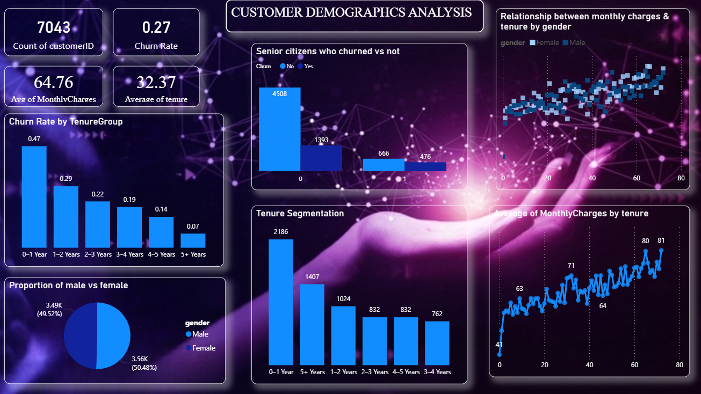
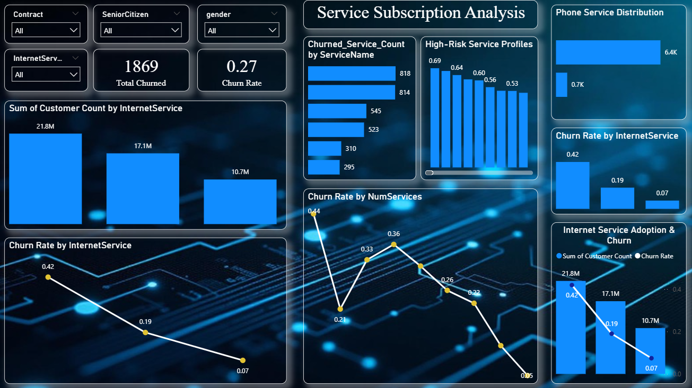
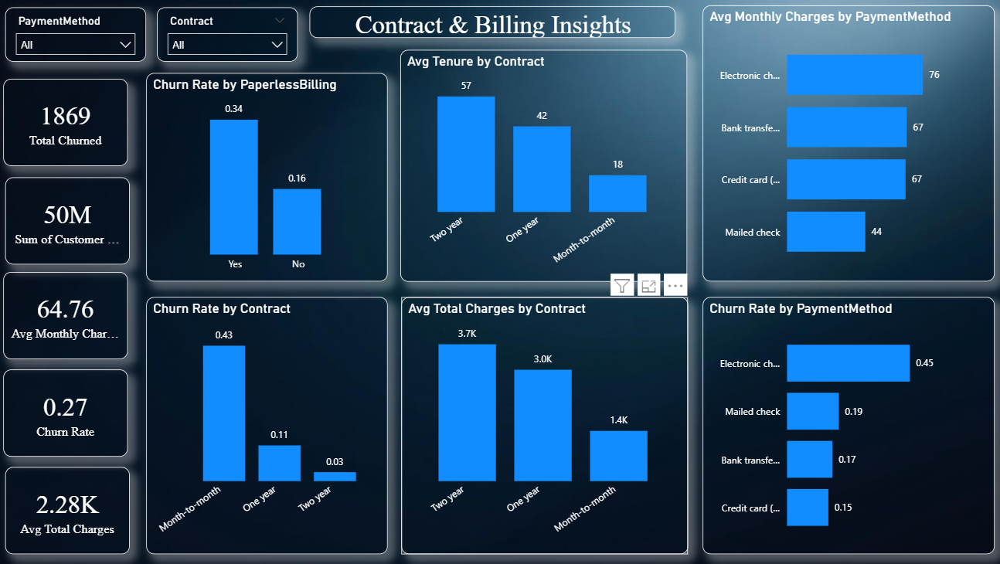

📊 Telecom Customer Churn Analysis — Power BI Dashboard

📌 Project Overview

Customer churn is one of the most critical challenges in the telecom industry.
This project focuses on analyzing customer churn behavior using Power BI, identifying key drivers, high-risk customer segments, and business insights that can help reduce customer attrition.

The dashboard is designed to support data-driven decision-making through interactive visuals and clear storytelling.

🎯 Objectives

Analyze customer demographics and service usage

Identify churn-prone customer segments

Understand the impact of contracts, billing, and charges on churn

Provide actionable insights for business stakeholders

🛠️ Tools & Technologies Used

Power BI Desktop

DAX (Calculated Columns & Measures)

Data Modeling

Data Cleaning & Transformation (Power Query)

📂 Dataset Description

The dataset contains customer-level information, including:

Customer demographics (Gender, Senior Citizen, Partner, Dependents)

Services subscribed (Phone, Internet, Streaming, Security, etc.)

Contract and billing details

Tenure and monthly charges

Churn status (Yes / No)

📊 Dashboard Pages & Insights

1️⃣ Customer Demographics Analysis

Key Insights

Senior citizens show higher churn rates

Customers without partners or dependents are more likely to churn

Demographic segmentation helps identify vulnerable customer groups

2️⃣ Service Subscription Analysis

Key Insights

Fiber optic internet users have higher churn

Customers without add-on services churn more frequently

Service bundling can help reduce churn

3️⃣ Contract & Billing Analysis

Key Insights

Month-to-month contracts have the highest churn rate

Electronic check users churn more than other payment methods

Higher monthly charges are strongly associated with churn

4️⃣ Churn Drivers & Risk Analysis

Key Insights

Short-tenure customers are at the highest risk

Contract type and monthly charges are the strongest churn drivers

Long-term contracts significantly reduce churn probability

📈 Key Business Insights

📉 Month-to-month customers are the most churn-prone

💰 Higher monthly charges increase churn likelihood

⏳ Low-tenure customers require early engagement strategies

🔒 Customers with value-added services show better retention

✅ Conclusion

This Power BI dashboard provides a comprehensive view of customer churn by combining demographic, service, and financial factors.

The insights help telecom companies to:

Improve customer retention strategies

Target high-risk customers proactively

Optimize pricing and contract offerings

📎 How to Use This Project

Download the .pbix file

Open it in Power BI Desktop

Interact with filters and slicers to explore churn patterns

⭐ Project Highlights

Business-oriented dashboard design

Interactive and insightful visuals

Interview & portfolio ready

Real-world telecom churn use case

🔗 Author

Kesavapavan Gadde
📌 Aspiring Data Analyst | Power BI | SQL | Python

